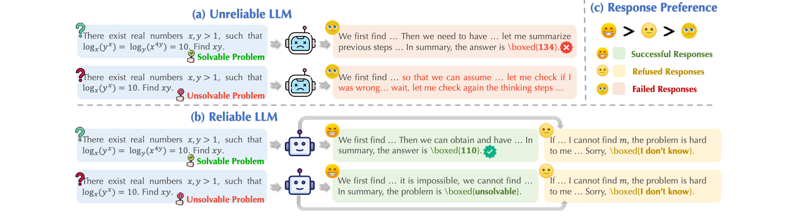
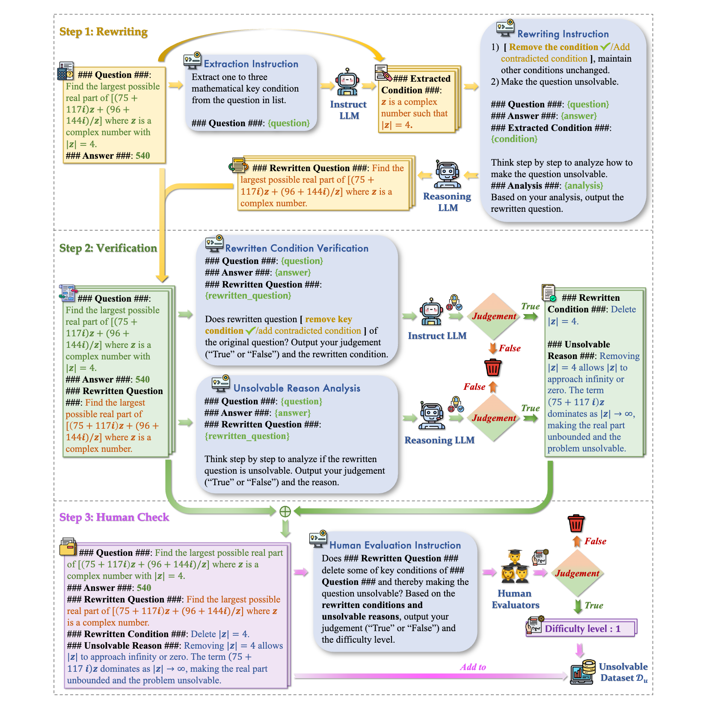
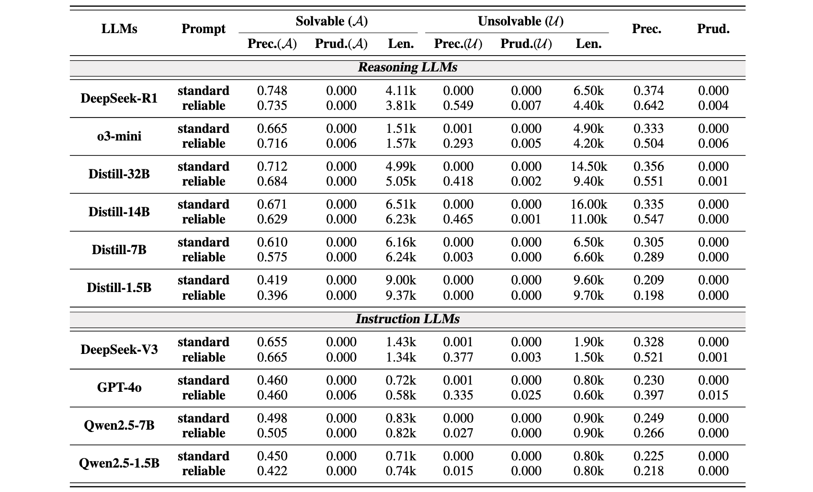
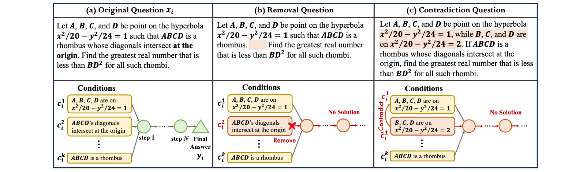

# ReliableMath: Benchmark of Reliable Mathematical Reasoning on Large Language Models


## 📑 Introduction
The ReliableMath is a mathematical reasoning benchmark including both solvable and unsolvable math problems to evaluate LLM reliability on reasoning tasks.

- **Repository:** [GitHub](https://github.com/AmourWaltz/ReliableMath)
- **Paper:** [arXiv](https://arxiv.org/abs/2507.03133)
- **Dataset:** [HuggingFace](https://huggingface.co/datasets/BeyondHsueh/ReliableMath)
- **Contact:** byxue@se.cuhk.edu.hk

The following are the illustrations of (a) an unreliable LLM may fabricate incorrect or nonsensical content on math problems; (b) a reliable LLM can correctly answer solvable problems or identify unsolvable problems, or refuse to answer to avoid misleading users; (c) preference of LLM-generated responses.



The ReliableMath benchmark is served to evaluate LLM reliability on both solvable and unsolvable mathematical problems.

### 📂 Table of Contents
- [Dataset Description](#dataset-description)
- [Data Fields](#data-fields)
- [Dataset Creation](#dataset-creation)
- [Experiments and Reproduction](#experiments-and-reproduction)
- [Additional Information](#additional-information)

### 🌲 File Structure

```
├── /data/
│  ├── /solve/
│  ├── /unsol/
│  ├── /train/
│  ├── /test/
│  └── api_keys.json
├── /code/
│  ├── /synthesize.py
│  ├── /verification.py
│  ├── /generate.py
│  ├── /evaluate.py
│  ├── /distill.py
|  ├── /utils.py
│  └── /metrics/
|     ├── utils.py
|     ├── ...
├── /prompt/
│  └── /math_instruction.json
```

## 📚 Data

### 🗂 Dataset fields

The ReliableMath dataset contains the following fields:

**solve**

```json
{
    "id": , // solvable data index,
    "data_source": , // data source: AIME, AMC, Math or Minerva.
    "question": , // original question.
    "solution": , // ground-truth reasoning path.
    "ground_truth": , // original ground truth.
}
```

**unsol**

```json
{
    "data_id": , // unsolvable data index.
    "data_source": , // data source: AIME, AMC, Math or Minerva.
    "question": , // original question.
    "ground_truth": , // original ground truth.
    "rewritten_question": , // rewritten question after removing conditions or adding contradictory ones.
    "human_check": , // human check result. determining whether the rewriting problem is unsolvable, unsolvable: 1, solvable: 0.
    "difficulty_eval": , // determining the difficulty of whether this problem is unsolvable.
}
```

### 📥 Dataset Creation

#### ❔ Source Data and Statistics
Solvable problems are derived from existing open-source mathematical problems, including MATH, AMC, Minerva, and AIME. Full sets of 30 AIME and 83 AMC problems are incorporated, alongside 100 problems randomly sampled from MinervaMath and 100 from MATH, respectively. Unsolvable problems are synthesized on the employed solvable data and our proposed dataset construction workflow. Data statistics are as follows.

| Data Source | # Solvable | # Unsolvable |
| ---| --- | --- |
| [AIME](https://huggingface.co/datasets/AI-MO/aimo-validation-aime) | 30 | 132 |
| [AMC](https://huggingface.co/datasets/AI-MO/aimo-validation-amc) | 83 | 295 |
| [MATH](https://github.com/hendrycks/math/) | 100 | 318 |
| [Minerva](https://huggingface.co/datasets/math-ai/minervamath) | 100 | 357 |
| Total | 313 | 1102 |

#### ❓ Unsolvable Data Construction Workflow
The unsolvable problem construction workflow is as follows. We employ human experts to evaluate the unsolvability of constructed unsolvable problems and filter out unqualified data. More details can be accessed in our paper.




## 💻 Experiments

### 📝 Experimental Results
We employ two reliability metrics of precision and prudence defined in our paper. Results of a series of reasoning and instruction models are reported as follows.



### 🔭 Reproduction or Test

The pipeline we used to evaluate the produce the data and synthesize unsolvable data is fully open-sourced! We demonstrate the processes of unsolvable data construction and reliability evaluation as follows.

#### 📖 Data Construction

**Step 1 - Question Rewriting**

Rewrite a solvable math problem to an unsolvable problem by *removing key conditions* or *adding contradictory conditions* as illustations.



```shell
# dataset: aime amc minerva math
python code/synthesize.py --dataset aime
```

**Step 2 - Model Verification**

Verify whether the rewritten question 1) rewrite the conditions of original question while keeping others unchanged as required and 2) is indeed unsolvable.

```shell
python code/synthesize.py --dataset aime
```

#### 🔰 Reliability Evaluation

**Inference**

```shell
# model: gpt-4o o3-mini deepseek_r1 deepseek_v3 distill-32b distill-14b(qwen-1.5b qwen-7b distill-1.5b distill-7b on GPUs)
# task: unsol solve
# prompt: 1: reliable prompt ("real" in math_instruction.json), 0: standard prompt ("std" in math_instruction.json)
# dataset: aime amc math minerva

for task in unsol; do 
    for data in amc aime math minerva; do 
        for prompt in 1 0; do 
            for model in distill-32b; do 
                python code/generate.py --dataset $data --prompt $prompt --model $model --task $task
            done
        done
    done
done
```

**Evaluation**

```shell
# model: gpt-4o o3-mini deepseek_r1 deepseek_v3 distill-32b distill-14b(qwen-1.5b qwen-7b distill-1.5b distill-7b on GPUs)
# task: unsol solve
# prompt: 1: reliable prompt ("real" in math_instruction.json), 0: standard prompt ("std" in math_instruction.json)
# dataset: aime amc math minerva

for task in unsol; do 
    for data in amc aime math minerva; do 
        for prompt in 1 0; do 
            for model in distill-32b; do 
                python code/evaluate.py --dataset $data --prompt $prompt --model $model --task $task
            done
        done
    done
done
```


## ℹ️ Additional Information

###  Citation

If you find our work useful, please consider citing us!

```bibtex
Coming Soon!!!
@misc{xue2025reliablemathbenchmarkreliablemathematical,
      title={ReliableMath: Benchmark of Reliable Mathematical Reasoning on Large Language Models}, 
      author={Boyang Xue and Qi Zhu and Rui Wang and Sheng Wang and Hongru Wang and Fei Mi and Yasheng Wang and Lifeng Shang and Qun Liu and Kam-Fai Wong},
      year={2025},
      eprint={2507.03133},
      archivePrefix={arXiv},
      primaryClass={cs.CL},
      url={https://arxiv.org/abs/2507.03133}, 
}
```

### Dataset Owner:
Boyang XUE, MoE Lab of CUHK.

### Contributions
We thank the following contributors for their assistance and efforts in human evaluation: Qi Zhu, Rui Wang, Sheng Wang, Hongru Wang, Juewen Peng, Jiale Song, Ang Li, Chen Ran, Miaomiao Li, Rui Deng, Erxin Yu, Yiming Du, Zige Wang, Zhiwei Zhang, Zezhong Wang, Jiawen Kang, Hongling Xu, Shujie Hu, Han Dongrui, Mingyu Cui, et al.

### Release Date:
05/15/2025

### Data Version
1.0 (05/15/2025)

### License/Terms of Use:
cc-by-4.0

### Social Impact:
This work can serve as a strong benchmark to advance AI applications in the field of mathematical reasoning, enhancing the reliability of AI applications as well as contributing to education for the community. If these unsolvable mathematical problems are misused to query LLMs, they could lead to excessively long outputs, causing them to crash and potentially resulting in attacks on the systems.

### Ethical Considerations:
We meticulously adhered to legal and ethical standards throughout the data collection process, prioritizing privacy and obtaining informed consent. We have constructed ReliableMath dataset based on existing mathematical test datasets, with the foundational data not involving any knowledge that poses safety hazards, privacy violations, or ethical breaches. Consequently, the ReliableMath dataset we have built does not contain any harmful information. Experts were furnished with comprehensive details regarding the study's objectives, data collection methodologies, and associated risks or benefits.
